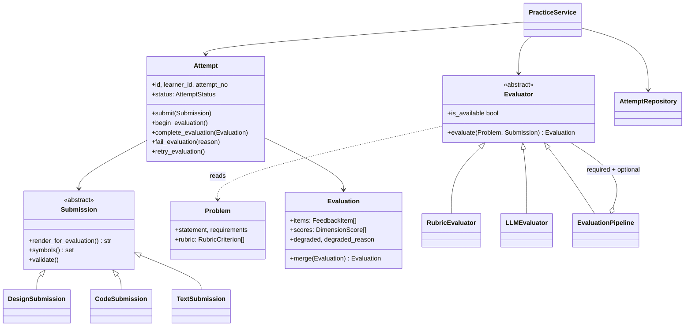

# Design note

## The MVP

One learner, three problems, and a loop they can go round more than once:

> choose a problem -> write a design -> submit -> get feedback -> review -> try again

Everything in the build serves the second lap. A platform that gives good
feedback once is a chat window; a platform where attempt 3 is measurably better
than attempt 1 is a product.

## User flow

| Step | Screen | What happens underneath |
|---|---|---|
| 1 | `/` | Problem catalogue plus the learner's recent attempts. |
| 2 | `/problems/{id}` | Statement, requirements, the editor, and the score trend for this problem if there is one. |
| 3 | POST submit | `Submission` built from the form, validated, `Attempt` created and stored, evaluation handed to a background runner. The request returns immediately. |
| 4 | `/attempts/{id}` | Shows `Evaluating` and refreshes itself. The submission is already durable, so leaving the page is safe. |
| 5 | same page | Overall score, per-dimension bars, feedback sorted gaps first, each item labelled with the evaluator that produced it and the evidence it rests on. |
| 6 | Try again | Back to step 2, where the sparkline now has two bars. |

## The important classes



Four seams carry the whole design.

**`Submission`** answers the first design question: *what must a learner
provide for an attempt to be meaningful?* The commitment is named classes,
a stated responsibility each, stated collaborators, and the trade-off they
knowingly made. Every subclass exposes three things, and evaluators depend on
those and nothing else:

- `render_for_evaluation()`, a flat text view, for the model
- `symbols()` and `declared_types()`, the words and the type names, for the checker
- `structural_notes()`, whatever the format can check about its own shape

That last one is why the extensibility claim below is true rather than
aspirational. It began as an `isinstance` ladder inside `RubricEvaluator`, which
meant a fourth format registered correctly and then silently received no
structural checks at all. A design knows what a god class looks like; code knows
whether it parses; prose knows it cannot be checked deeply. The evaluator asks
and does not care which format answered, stamping its own name on what comes
back so the learner still knows who is making the claim.

`CodeSubmission.symbols()` walks the Python AST rather than matching words, so
a class mentioned only in a comment does not satisfy a rubric criterion. That
distinction is a test, not a hope.

**`Evaluator`** is the strategy seam. `evaluate(problem, submission)` returns an
`Evaluation` or raises `EvaluationError`. Evaluators never see the `Attempt`, so
evaluation is a pure function of what was asked and what was handed in and can
be replayed against an old submission when the rubric changes.

**`Attempt`** owns its lifecycle. No service assigns `status`; it asks for a
transition and the aggregate decides. The table is five lines and every illegal
edge has a test.

```
DRAFT --submit--> SUBMITTED --start--> EVALUATING --complete--> EVALUATED
                                           |
                                           +--fail--> FAILED --retry--> EVALUATING
```

**`AttemptRepository`** keeps SQL out of everything else. `sqlite_store.py` is
the only file in the project that knows SQL.

## Evaluation approach

The rule the whole product rests on:

> **Deterministic where the answer is a fact. A model where the answer is a
> judgement.**

| `RubricEvaluator`, no network | `LLMEvaluator` |
|---|---|
| Is the concept named at all, and named as a type where that is the claim | Does the abstraction earn its place |
| Is a responsibility stated per class | Is it the right responsibility |
| Does the code parse | Is behaviour in the right class |
| Does one class hold most of the methods | Is that class coordinating or doing |
| Is a trade-off stated | Is it a real trade-off |

This answers the third design question directly. Coverage and structure are
facts: they cost nothing, return the same answer tomorrow, and are defensible
when a learner disagrees. Whether `SpotAllocator` earns its place is a
judgement, and no keyword list will ever have an opinion about it.

Both halves emit the same `Dimension` and `Severity` vocabulary, so
`Evaluation.merge` can average per-dimension scores and concatenate items.
Items are never deduplicated: two sources agreeing is information.

### Useful feedback when several answers are valid

The second design question. Four mechanisms, all in the code:

1. **Never say correct.** Feedback is an observation, a dimension, a severity
   and a quote. There is no reference solution in the codebase to compare
   against, deliberately.
2. **Evidence is mandatory and checked.** Every rubric item cites the learner's
   own symbol. Every model item must carry a quote, and
   `LLMEvaluator._evidence_supported` drops items whose quote does not
   sufficiently overlap the learner's own vocabulary, showing the withheld
   count. This runs on our side rather than trusting the model, and it reliably
   catches critique of classes the learner never named. Being honest about its
   limit: it compares bags of words, not substrings, so a fabricated sentence
   built from the learner's own vocabulary can pass, and quotes under three
   significant words are waved through. Substring matching against
   `render_for_evaluation()` would close both, and is the next change here.
3. **Synonyms count.** `spot`, `slot`, `bay` and `space` satisfy one criterion.
   Multi-word keywords need every word, so `parking` alone does not earn
   `parking spot`. Penalising vocabulary rather than modelling is the failure
   that makes automated LLD review useless.
4. **Criteria say where they may match.** `RubricCriterion.scope` is either
   `ANYWHERE` or `TYPE_NAME`. Two different questions hide behind "is this
   concept present", and conflating them credited a god class with a
   `get_change` method for "making change is its own responsibility", and a
   design that said "opens the doors" for "the car has an explicit state".
   Criteria that are claims about a type existing match only against class and
   collaborator names, which `Submission.declared_types()` supplies and
   `CodeSubmission` takes from `ast.ClassDef`. Found by running the Elevator
   and Vending Machine problems end to end, not by reading the code.
5. **Sources stay visible.** `rubric` and `llm` are labelled separately in the
   UI so a learner can weight a mechanical check differently from an opinion.

### Scoring

Unweighted mean of dimension scores. Weighting one LLD axis above another is a
product claim not yet earned, and a hidden weight makes a score impossible to
argue with. The per-dimension bars are the real output; the single number exists
so the sparkline has something to plot.

## Slow and failing evaluation

The fourth design question, kept practical.

**Slow.** `PracticeService.submit` stores the attempt and hands evaluation to a
`TaskRunner`, then returns. `EVALUATING` is a persisted state, not the duration
of an HTTP request, so the learner can close the tab. The web app uses a small
thread pool; tests use `InlineRunner`, so the suite is deterministic with no
sleeps and no `if testing` branch in the service.

**Failing.** `EvaluationPipeline` splits evaluators into `required` and
`optional`. The rubric is required and needs no network. The model is optional.
When it fails, the learner gets the deterministic result with `degraded` set and
the reason shown, not an error page. When it fails hard, the attempt goes to
`FAILED` and offers a retry that costs nothing because the submission is already
stored. `run_evaluation` catches bare `Exception` as well, so a bug in an
evaluator produces a failed attempt rather than one stuck on "evaluating"
forever. That is a test.

**Restarts.** A thread pool does not survive a process exit, so
`resume_pending` re-schedules anything left in `SUBMITTED` or `EVALUATING` at
startup. It is the cheap version of a durable queue and the exact seam a real
queue would replace.

**Quota.** Free-tier model quota is per model per day, and a 429 covers both a
per-minute burst and a per-day wall. `GeminiClient` branches on the response
body rather than the status code, walks a ladder of pinned model ids, and never
uses a `-latest` alias, because an alias repoints to whatever is newest and
newest carries the smallest allowance.

## Extending it later

The fifth design question. Three concrete extensions, with the actual diff size:

| Extension | What changes |
|---|---|
| A diagram submission format (Mermaid, PlantUML) | One `Submission` subclass, plus one branch in `web/forms.py` because the form must know which fields to read. Zero evaluator changes, and there is a test that asserts exactly that by defining a fourth format and running it through `RubricEvaluator`. |
| A different evaluation strategy (static analysis, a peer review queue, a second model) | One `Evaluator` subclass, one line in `config.build_evaluator`. It joins the merge automatically. |
| Postgres instead of SQLite | One `AttemptRepository` implementation. The domain, services and web layers do not compile-time depend on sqlite3 at all. |

The seams are load-bearing rather than decorative: `LLMEvaluator` was added
after `RubricEvaluator` was already working, and adding it changed one line of
`config.py`.

## Trade-offs made, and what was given up

| Decision | Given up |
|---|---|
| Rubric required, model optional | The platform can return feedback a learner finds shallow. Preferred to feedback that never arrives. |
| Keyword matching for the deterministic half | Under-rewards an unusual but excellent design. Bounded by being one half of the score, and labelled. |
| Structured `DesignSubmission` as the primary format | Some learners think in prose or code. Both are accepted, and told they get shallower feedback rather than silently scored lower. |
| Unweighted dimension mean | A missing `PricingStrategy` counts the same as a missing `Payment`. Arguable, and honest. |
| Thread pool, not a queue | Evaluation does not survive a restart. `resume_pending` covers it at this scale. |
| No auth, fixed learner id | No multi-user story. Every service call already takes `learner_id`, so a session drops in at the web layer alone. |

## Deliberately not built

Auth and accounts, a diagram editor, problem authoring UI, spaced repetition,
anything about scale. The assignment asks for LLD rather than HLD, and each of
these would have taken time from the domain model, which is the thing actually
being assessed.

## If it needed to serve more users

Kept short on purpose. The service is stateless apart from SQLite, so the first
two moves are: put evaluation on a real queue behind the existing `TaskRunner`
interface, and move `AttemptRepository` to Postgres. Both are single-class
swaps. Model latency dominates everything else, so the third move is caching
evaluations by `(problem_id, submission hash)`, which the pure-function shape of
`Evaluator` already permits.
